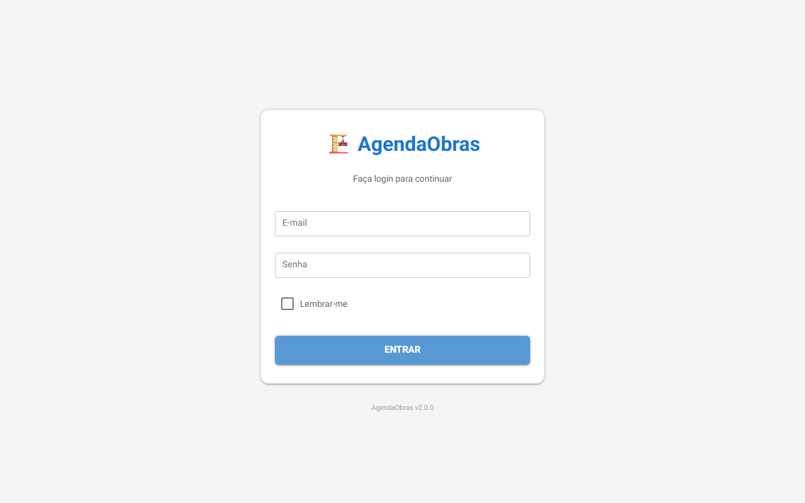
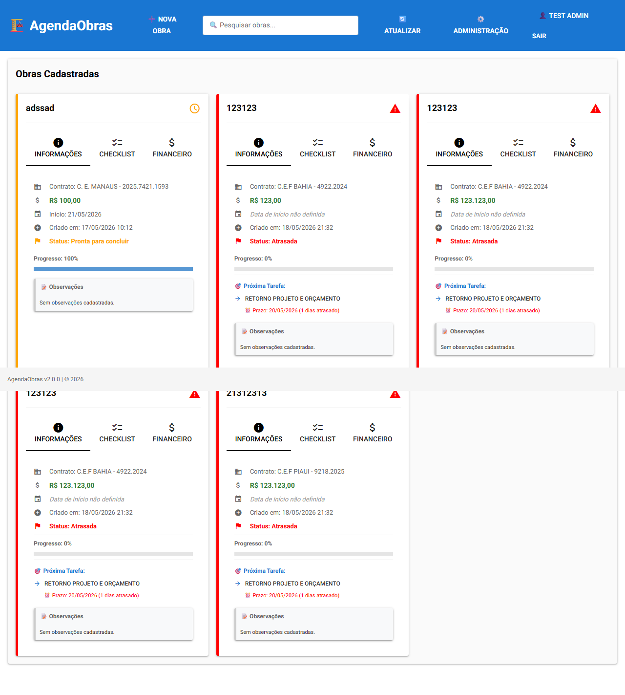

# Run AgendaObras

AgendaObras is a NiceGUI web app (Python) that serves on `http://localhost:8080`.

## Prerequisites

- Python 3.12+ on PATH
- Git Bash or WSL available (for background launch)

## Step 1 — Install dependencies

```powershell
pip install -r requirements.txt
```

Packages installed: `nicegui>=1.4.0`, `python-dateutil`, `python-dotenv`, `packaging`, `tzdata`.

For screenshots, also install Playwright:

```powershell
pip install playwright
python -m playwright install chromium
```

## Step 2 — Launch the app in background

**Important:** Launch with `PYTHONUTF8=1` to avoid Windows charmap encoding errors (the app uses Unicode emoji characters that cause a 500 error without it).

Use Git Bash or WSL:

```bash
cd "/c/Users/dawis/OneDrive/Documentos/GitHub/AgendaObras"
PYTHONUTF8=1 PYTHONIOENCODING=utf-8 python AgendaObras.py > /tmp/agenda_out.txt 2>&1 &
echo "PID: $!"
```

Wait ~7 seconds for NiceGUI to start, then verify:

```bash
curl -s -o /dev/null -w "HTTP Status: %{http_code}\n" http://localhost:8080/login
# Expected: HTTP Status: 200
```

You should see in `/tmp/agenda_out.txt`:
```
NiceGUI ready to go on http://localhost:8080, ...
```

## Step 3 — Kill a running instance (if needed)

```powershell
# Find PID on port 8080
netstat -ano | Select-String ":8080"
# Kill by PID
Stop-Process -Id <PID> -Force
```

## Step 4 — Auth: First run vs existing users

- **First run (no users.db):** The login page shows a "Create Admin" form instead of the login form. Fill all fields to create the first admin user.
- **Subsequent runs:** Standard email/password login form.

### Create a test user via Python (for scripted testing):

```python
import sys
sys.path.insert(0, r'C:\Users\dawis\OneDrive\Documentos\GitHub\AgendaObras')
from db.auth_repo import AuthDatabase
db = AuthDatabase()
db.criar_usuario('Test', 'Admin', 'admin@test.com', 'admin1234', is_admin=True)
```

The users database is stored at `users.db` in the project root (or at `AGENDA_OBRAS_USERS_DB_PATH` env var if set).

## Step 5 — Take screenshots with Playwright

```python
from playwright.sync_api import sync_playwright

with sync_playwright() as p:
    browser = p.chromium.launch(headless=True)
    page = browser.new_page(viewport={'width': 1280, 'height': 800})

    # Screenshot the login page
    page.goto('http://localhost:8080/login', wait_until='networkidle', timeout=15000)
    page.screenshot(path='login_screenshot.png')

    # Log in
    page.locator('input').nth(0).fill('admin@test.com')
    page.locator('input').nth(1).fill('admin1234')
    page.click('button')
    page.wait_for_url('http://localhost:8080/', timeout=10000)
    page.wait_for_load_state('networkidle', timeout=10000)

    # Screenshot the main page
    page.screenshot(path='main_screenshot.png', full_page=True)
    print('Title:', page.title())
    print('URL:', page.url)
    browser.close()
```

## Key facts

| Property | Value |
|---|---|
| Entry point | `AgendaObras.py` |
| Port | `8080` |
| Login URL | `http://localhost:8080/login` |
| Main URL | `http://localhost:8080/` |
| Auth redirect | Unauthenticated requests to `/` redirect to `/login` |
| Users DB | `users.db` in project root |
| App DB | `agendaobras.db` + `contratos.db` in project root |
| Version | v2.0.0 |

## Known issues

- **Windows charmap error (500 on main page):** The app uses Unicode emoji in Python string literals (e.g., `✅` in `agenda_obras.py`). Always launch with `PYTHONUTF8=1` on Windows to avoid `UnicodeEncodeError: 'charmap' codec can't encode character`.
- **email_config.env:** Optional. If missing, email alerts are disabled but the app runs normally. The `NICEGUI_STORAGE_SECRET` for session storage falls back to an empty string if not configured.
- **Port conflict:** If port 8080 is already in use, find and kill the old process before relaunching.

## Screenshots

Login page:


Main page (logged in):

